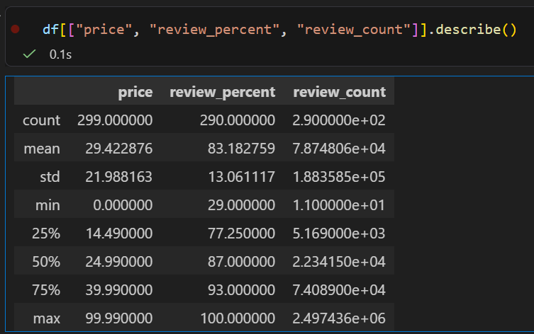
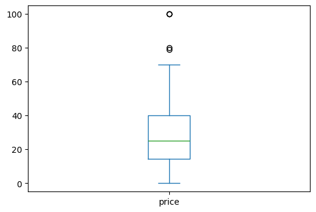
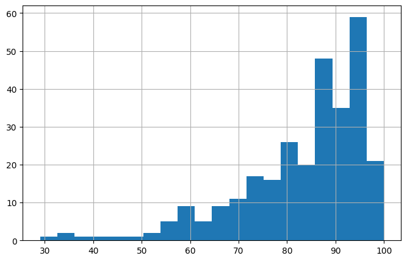

# Scraping Steam’s Top‑Selling Games: My First Curated Dataset

For this Stat 386 project, I wanted to build a dataset that wasn’t already cleaned or packaged for me. I also wanted something fun and something I actually cared about. Since I play games on Steam, I thought it would be interesting to scrape data from the Steam Store and see what I could learn about the games that show up on the “Top Sellers” list.

This project ended up teaching me a lot about how websites load data, how messy real‑world text can be, and how to turn scraped information into a clean dataset that I could actually analyze.

---

## Why I Chose This Project

Steam is a huge platform, and the games that appear in the Top Sellers list change constantly. These games also have a lot of useful information attached to them—prices, release dates, review scores, and review counts. All of this is public, and it updates in real time.

I liked the idea of collecting this data myself and seeing whether things like price or review sentiment seemed related to how popular a game is. I love video games and enjoy playing many different types. I felt that analyzing the prices and release dates could be very indicative of a games popularity.

---

## My Main Question

The question I focused on was:

**How do price and review sentiment relate to a game’s popularity on Steam?**

I used **review_count** as a rough measure of popularity, since more reviews usually means more players. I used **review_percent** to represent how positively players feel about the game. And of course, **price** is important because Steam has everything from free‑to‑play games to $70 AAA titles.

---

## Making Sure the Scraping Was Ethical

Before scraping anything, I checked that:

- Steam’s store pages are public and don’t require logging in.
- I wasn’t collecting anything private or personal—only game titles, prices, and review summaries.
- I wasn’t sending too many requests or trying to get around any restrictions.
- I wasn’t violating any terms of service.

Everything I scraped is visible to any user who visits the Steam Store.

---

## How I Got the Data (High‑Level Summary)

Steam uses infinite scrolling on the Top Sellers page. When you scroll down, the website quietly loads more results from a JSON endpoint. Instead of trying to simulate scrolling, I requested that endpoint directly.

Here’s the basic process I followed:

1. Request multiple “chunks” of results (0–100, 100–200, 200–300, etc.).
2. For each chunk, extract:
   - game title  
   - release date  
   - price (Steam has different formats depending on discounts)  
   - review percent  
   - review count  
3. Save everything into a raw CSV file.
4. Clean the data in a separate script.

---

## Cleaning the Data

The raw data needed a lot of cleaning. Some examples:

- Prices sometimes show up as `$29.99`, sometimes as `$39.99 $19.99` (if discounted), and sometimes as “Free.”
- Review summaries come in strings like “97% positive — 18,537 user reviews.”
- Release dates include full text like “Released on Feb 14, 2024.”

In my cleaning script, I:

- Converted “Free” and “Free To Play” to `0.00`.
- Extracted the last numeric price from any price string.
- Pulled out the numeric review percent.
- Pulled out the numeric review count.
- Extracted just the release year.
- Removed duplicates.

The final cleaned dataset is saved as `steam_cleaned.csv`.

---

## Overview of the Final Dataset

The dataset ended up with **300 games** and **5 features**:

| Feature | Description |
|--------|-------------|
| `title` | Name of the game |
| `release_year` | Year the game was released |
| `price` | Price in USD (0 for free games) |
| `review_percent` | Percent of positive reviews |
| `review_count` | Number of user reviews |

---

## Visual Summary of the Data

These visuals come from my Jupyter notebook and helped me understand the structure of the dataset and identify important patterns.

### Summary Statistics for Numeric Columns

These summary statistics give a quick overview of the numeric features. Review counts have a very large range, which already shows how uneven game popularity is on Steam. Prices also vary widely, from free games to full‑price titles.

---

### Price Distribution (Boxplot)

The boxplot shows that Steam game prices are heavily right‑skewed. Many games are free or low‑priced, and there are several higher‑priced outliers. This makes sense because the Top Sellers list includes everything from indie games to major AAA releases.

---

### Review Percent Distribution (Histogram)

Most top‑selling games have fairly high review percentages, but there is still meaningful variation. This suggests that while many popular games are well‑reviewed, not all of them are universally loved. The histogram also shows why review_percent is a useful feature for exploring player sentiment.

---

## Data Quality Notes

A few things stood out while exploring the dataset:

- Some games have missing prices because they haven’t been released yet.
- Review counts vary a lot, which makes sense because popularity is uneven.
- The dataset only includes top sellers, so it doesn’t represent all Steam games.
- Prices reflect the U.S. storefront and may differ in other regions.

---

## Code and Resources

All of my code and the final dataset are available in my GitHub repository:

**[GitHub Repository Link](https://github.com/JDeleon2342/steam-data-project)**

The repo includes:

- `steam_scraper.py`  
- `steam_clean.py`
- `steam_exploration.ipynb`
- `steam_cleaned.csv`  
- A README explaining how everything works  

---

- **Original Source:** The dataset was created by scraping publicly available information from the Steam Store’s Top Sellers page. 
You can view the source here: [Steam Top Sellers](https://store.steampowered.com/search/?filter=topsellers).

---

## Final Thoughts

This project helped me understand how to scrape data, clean messy text, and build a dataset from scratch. It also gave me a chance to explore a question I actually care about. Even though the dataset is simple, it’s big enough and clean enough to support interesting observations about how price and reviews relate to popularity on Steam.

